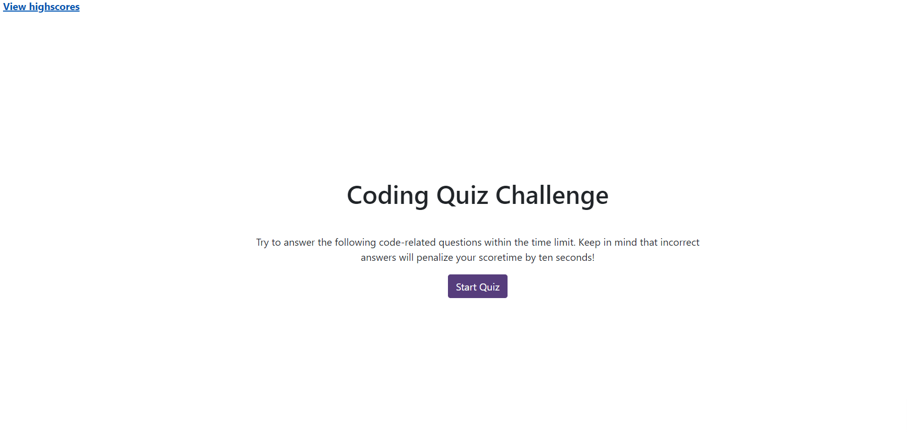

web-apis-code-quiz-mandy

# Description 

* This is a timed code quiz with multiple-choice questions. This app will run in the browser and feature dynamically updated HTML and CSS powered by JavaScript code. It will also feature a clean and polished user interface and be responsive, ensuring that it adapts to multiple screen sizes.

# 

# Deployed url

* https://github.com/mandywl/04-web-apis-code-quiz-mandy
* https://mandywl.github.io/04-web-apis-code-quiz-mandy/

# Instructions

* Clicking the 'Start Quiz' button to display a series of questions

* Once the quiz begins, a countdown timer starts

* If a question is answered incorrectly, 10 seconds is subtracted from the timer

* The timer ends when all questions have been answered or the timer reaches 0

* After the game ends, user can save their initials and score to view a highscores page
